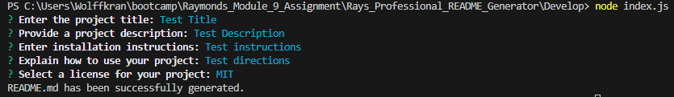

# Professional README Generator Starter Code

## Description

This project serves as the starter code for a Professional README Generator. You can use this code to quickly generate high-quality README files for your own projects.

## Installation
To set up the development environment, follow these installation steps:

1. Go to https://github.com/Wolffkran/Rays_Professional_README_Generator.git
2. Download the zip and extract to the chosen folder
3. Run npm install to download dependencies.

## Usage
To effectively use this project, follow these instructions:

1. Open the integrated terminal
2. Run node index.js
3. Answer the following prompts

## License

This project is licensed under the [MIT License](https://opensource.org/licenses/MIT).

